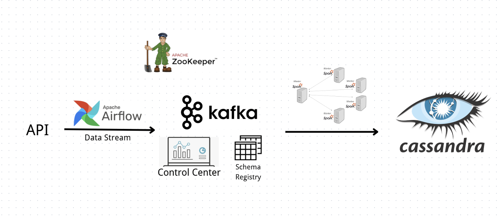

# Simplified Real Time Data Streaming Pipline
use airflow, kafka, spark and cassandra to build a realtime data pipline for ingestion, process and strorage 



### How the system works?

##### ZooKeeper:

- Resource and space manager.

##### Airflow:

- The scheduler is used to schedule tasks. 
- These tasks involve requesting data from an API and then sending it to Kafka as a Kafka producer. 
- Airflow uses PostgreSQL as its backend database.

##### Kafka:

- Message queue system for receiving and sending data

##### Control Center:

- Manage Kafka cluster.

##### Schema registry:

- There is no need to submit the schema repeatedly during data transfer.

##### Spark:

- Data cleaning and processing, reading data from Kafka and sending it to Cassandra

##### Cassandra:

- Final data storage.

### How to run the pipeline?

##### Install:

- Docker desktop

##### Pull Docker image:

```
docker pull <image name>
```


- apache/airflow:2.10.5-python3.10
- confluentinc/cp-zookeeper:7.4.0
- confluentinc/cp-server:7.4.0
- confluentinc/cp-schema-registry:7.4.0
- confluentinc/cp-enterprise-control-center:7.4.0
- postgres:13.0
- bitnami/spark:3.5.1
- cassandra:5.0.5

##### Run container topo:

```
docker compose up -d
```

